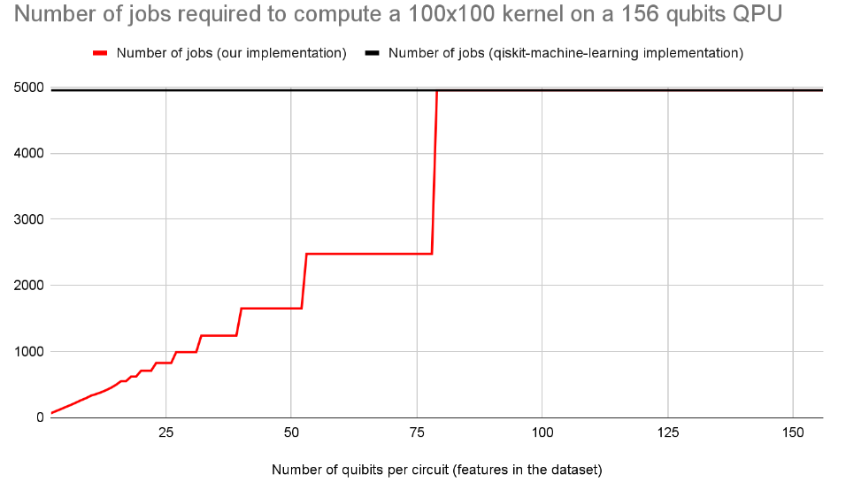
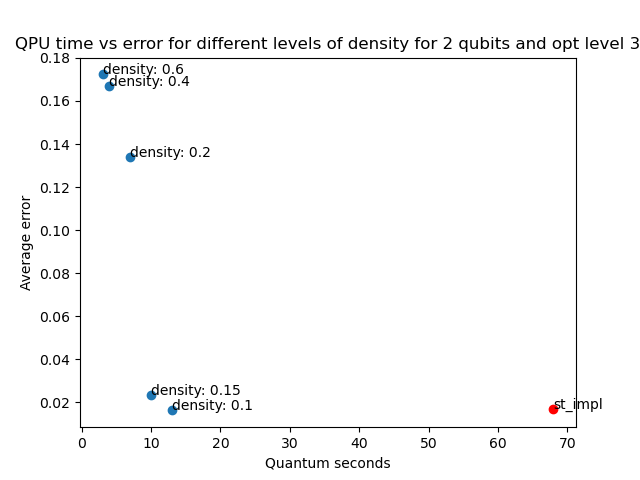
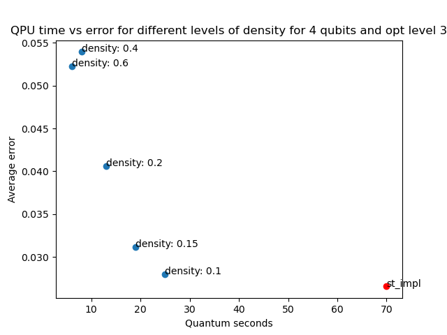

# Enhancing Efficiency in QKM via Parallel Circuit Implementation.

# PROJECT DESCRIPTION

In recent years, Quantum Kernel Methods (QKMs) have emerged as promising tools for a range of machine learning tasks, including classification, clustering, and anomaly or novelty detection. Superior performance of QKMs with respect to classical kernel methods has been proven on a variety of datasets.
The popularity of these methods is also due to open-source implementations with a high degree of abstraction, such as Qiskit Machine Learning (https://qiskit-community.github.io/qiskit-machine-learning/).
However, the practical implementation of QKMs is accompanied by several challenges. As with all kernel methods, QKMs exhibit quadratic scaling with the size of the dataset: to compute a kernel for a dataset of n points, one needs to run n(n−1)/2 circuits (each with several shots). In the current implementation, each circuit is submitted to the QPU as an independent job.
The number of qubits required by each circuit is generally equal (or proportional) to the number of features in the dataset, which is a small number in many applications. Therefore, in cases where the number of qubits required is smaller than the number of qubits available on a QPU, the current implementation of QKMs is inefficient as it underutilizes the number of qubits available.
With this project, we aim to increase efficiency by implementing several circuits in parallel. In this way, we can 1) make efficient use of all the qubits on a given QPU without increasing the circuits' depth, and 2) reduce the number of jobs required to calculate a given kernel.

The image below contrasts the current implementation and our proposed implementation for calculating a kernel derived from a dataset of 100 points on a 156-qubit machine. The image shows the number of jobs required to calculate the kernel (on the vertical axis) when varying the dataset dimensionality (here we assume the number of features in the dataset equals the number of qubits used for calculating each entry of the kernel - this is the typical case). The graph shows a decisive advantage of our method for datasets with low dimensionality compared to the total number of qubits available (156 in our example). 

Note that a lower number of jobs submitted translates into a low QPU time utilization and therefore to significant cost saving. 
Our implementation will be open source and compatible with the widely used Qiskit Machine Learning 0.8.2 library. With our work we will contribute directly to the qiskit-machine-learning project. 

 # CURRENT IMPLEMENTATION

The current implementation available in this GitHub is a prototype, which only supports fidelity-kernels of all sizes. 
The goal of this prototype is only to show that the method can work and to run a first test on real QPUs. 
The goal of the project is to create a universal implementation supporting kernels of all types and sizes.

# PRELIMINARY RESULTS

We tested our prototype on a IBM 127 qubits machine (ibm_kyiv). The speed up optained is as according to the theoretical speed up described in the figure above, i.e., the QPU time is proportional to the number of jobs.

Obviously, the parallelization introduce additional error on NISQ machines mostly due to cross-talks and inefficient mapping of quibits to physical qubits on the actual hardware. The "denser" is the parallelization, the higher are the speedup and the additional error introduced. 
To be able to balance the tradeoff between the speedup and the additional error, we introduced the parallelization density as an additional parameter. This parameter take values between 0 and 1 and describe how many of the qubits available on the QPU are actually used. 
We tested the effect of different levels of density on IBM 127 qubits machine ibm_kyiv, for calculating a 8x8 non-symmetric matrix (64 independent entries) using 2 and 4 qubits for different levels of the optimization_level parameter as in qiskit.transpiler.preset_passmanagers . 

The figures below show the results for 2 and 4 qubits and optimization_level = 3. They display a scatter plot of the QPU time used for calculating the kernel (in seconds) and the average error (on each kernel matrix entry). The blue points refer to runs which used our novel efficient implementation. The red dot is calculated with the standard qiskit-machine-learning implementation and it is used as a benchmark. The error levels have been calculated with respect to the kernel computed on a noise-free simulator. 
It can be observed that for higher levels of density the speedup is significant, but the results are too noisy. For density around [0.1, 0.15] we still have a 3x-7x speedup while the additional error introduced by the parallelization is negligible. 

For more details about this experiment please check the files Test_error_and_QPU_time.py, process_and_plot_test_results.py, config_test.json. All the calculated kernels, the metrics and the plots are avilable in the folder Test_results/impact_of_density/

# FUTURE WORK

We plan to implement our method to support other types of kernels. 
Also, we plan to implement an efficient transpillation algorithm mapping effiiently qubits to physical qubits which takes into account the connectivity of the machine, to reduce cross-talks and error. 